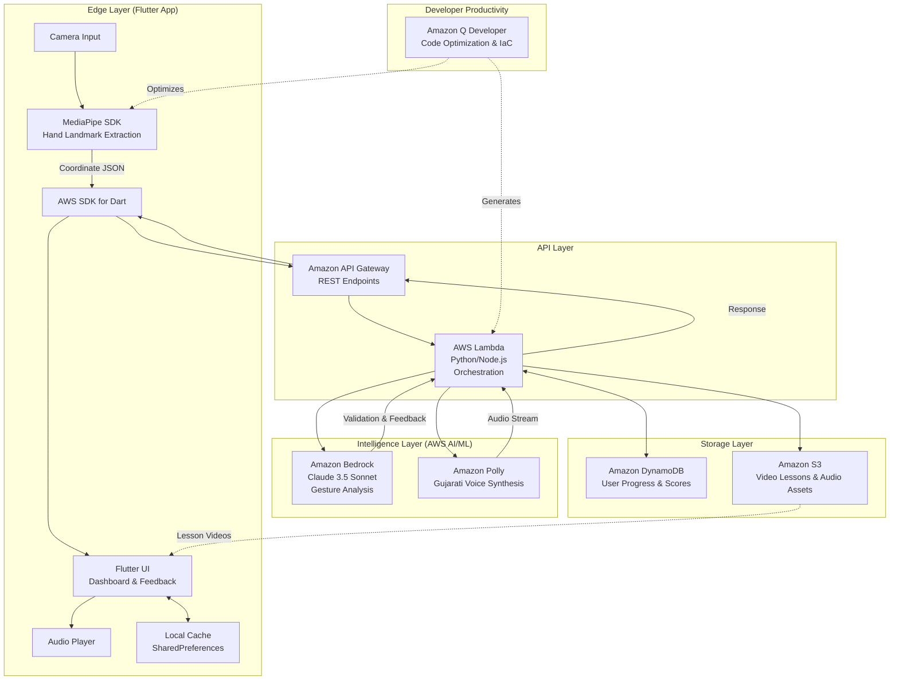
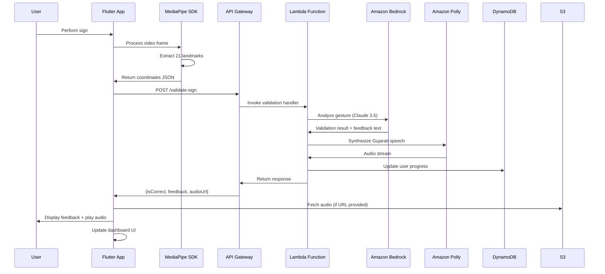

# Design Document: SahajMudra

## Overview

SahajMudra is a serverless, event-driven application that enables users to learn Indian Regional Sign Languages through real-time AI-powered feedback. The system architecture prioritizes privacy by processing video locally while leveraging AWS cloud AI services for validation and feedback generation.

The application consists of:
- **Frontend (Edge Layer)**: Flutter cross-platform mobile app with MediaPipe SDK for local hand landmark extraction
- **API Layer**: Amazon API Gateway with AWS Lambda functions (Python/Node.js) orchestrating data flow
- **Intelligence Layer**: Amazon Bedrock (Claude 3.5 Sonnet) for gesture analysis and Amazon Polly for Gujarati voice synthesis
- **Storage Layer**: Amazon DynamoDB for user progress and Amazon S3 for multimedia assets
- **Developer Productivity**: Amazon Q Developer for code optimization and Infrastructure as Code generation

The design emphasizes low latency (<2s end-to-end), privacy (local video processing), scalability (modular language support), and serverless cost efficiency.

## Architecture

### System Architecture



### Component Interaction Flow



### Serverless Event-Driven Architecture

The system follows a serverless, event-driven pattern:

1. **Edge Processing**: Flutter app with MediaPipe processes video frames locally, extracting hand landmarks without sending raw video to the cloud
2. **API Gateway**: Manages RESTful endpoints (/validate-sign, /get-progress, /get-lessons) with request validation and throttling
3. **Lambda Orchestration**: Stateless functions orchestrate calls to Bedrock and Polly, handle business logic, and manage DynamoDB transactions
4. **Asynchronous Processing**: Audio synthesis can be processed asynchronously with S3 pre-signed URLs for large audio files
5. **Auto-Scaling**: All AWS services auto-scale based on demand, ensuring consistent performance during peak usage

## Components and Interfaces

### 1. Flutter Frontend (Edge Layer)

**Responsibility**: Cross-platform mobile UI, local hand tracking, and user interaction

**Technology**: Flutter (Dart), MediaPipe SDK for Flutter

**Key Packages**:
- `google_ml_kit` or `mediapipe` for hand landmark detection
- `aws_sdk` for Dart (AWS API integration)
- `shared_preferences` for local caching
- `audioplayers` for audio playback

**Interface**:
```dart
// Main app state management
class SahajMudraApp extends StatefulWidget {
  @override
  _SahajMudraAppState createState() => _SahajMudraAppState();
}

// Hand tracking service
class HandTrackingService {
  // Initialize MediaPipe with camera stream
  Future<void> initialize(CameraController camera) async;
  
  // Start continuous hand tracking
  Stream<HandLandmarks> startTracking();
  
  // Stop tracking and release resources
  Future<void> stopTracking() async;
  
  // Get current hand landmarks
  HandLandmarks? getCurrentLandmarks();
}

class HandLandmarks {
  final List<Point3D> landmarks;  // 21 3D points
  final Handedness handedness;
  final DateTime timestamp;
  
  Map<String, dynamic> toJson();
}

class Point3D {
  final double x;  // Normalized 0-1
  final double y;  // Normalized 0-1
  final double z;  // Depth relative to wrist
}

enum Handedness { left, right }
```

**Implementation Notes**:
- Use MediaPipe Hands solution with model complexity = 1 (full accuracy)
- Process at 30 FPS for smooth tracking
- Normalize coordinates to 0-1 range for device independence
- Run entirely on device (no server-side video processing)
- Cache lesson videos and audio locally for offline practice

### 2. API Gateway (API Layer)

**Responsibility**: Manage RESTful endpoints, request validation, and throttling

**Technology**: Amazon API Gateway (REST API)

**Endpoints**:

```
POST /validate-sign
Request:
{
  "userId": "string",
  "signId": "string",
  "dialectModule": "string",
  "coordinates": {
    "landmarks": [{"x": 0.5, "y": 0.3, "z": 0.1}, ...],
    "handedness": "right",
    "timestamp": 1234567890
  }
}

Response:
{
  "isCorrect": boolean,
  "confidence": number,
  "feedback": {
    "text": "string",
    "textGu": "string",
    "type": "positive" | "corrective",
    "instructions": ["string"]
  },
  "audioUrl": "string",  // S3 pre-signed URL
  "deviations": [
    {
      "landmarkIndex": number,
      "description": "string",
      "magnitude": number
    }
  ]
}

GET /lessons/{dialectModule}
Response:
{
  "moduleId": "string",
  "signs": [
    {
      "signId": "string",
      "name": "string",
      "nameGu": "string",
      "difficulty": number,
      "videoUrl": "string",
      "imageUrl": "string"
    }
  ]
}

GET /progress/{userId}
Response:
{
  "currentLevel": number,
  "totalSignsCompleted": number,
  "unlockedModules": ["string"],
  "progressByModule": {
    "gujarati": {
      "completed": number,
      "total": number,
      "accuracy": number
    }
  }
}

POST /progress/{userId}
Request:
{
  "signId": "string",
  "moduleId": "string",
  "isCorrect": boolean,
  "accuracy": number
}
```

**Configuration**:
- Enable CORS for Flutter web deployment
- Request throttling: 100 requests/second per user
- Request validation using JSON Schema
- API key authentication for mobile apps
- CloudWatch logging for all requests

### 3. Lambda Functions (Orchestration Layer)

**Responsibility**: Orchestrate AI services, business logic, and data persistence

**Technology**: AWS Lambda (Python 3.11 or Node.js 18)

**Functions**:

#### ValidateSignHandler
```python
# Lambda: validate-sign-handler
import boto3
import json
from typing import Dict, Any

bedrock = boto3.client('bedrock-runtime')
polly = boto3.client('polly')
dynamodb = boto3.resource('dynamodb')
s3 = boto3.client('s3')

def lambda_handler(event: Dict[str, Any], context: Any) -> Dict[str, Any]:
    """
    Orchestrates sign validation workflow:
    1. Parse request from API Gateway
    2. Call Bedrock for gesture analysis
    3. Generate feedback text
    4. Synthesize audio with Polly
    5. Store audio in S3
    6. Update user progress in DynamoDB
    7. Return response
    """
    body = json.loads(event['body'])
    user_id = body['userId']
    sign_id = body['signId']
    coordinates = body['coordinates']
    
    # Step 1: Validate with Bedrock
    validation_result = validate_with_bedrock(sign_id, coordinates)
    
    # Step 2: Generate feedback
    feedback = generate_feedback(validation_result, body.get('language', 'en'))
    
    # Step 3: Synthesize audio (async)
    audio_url = synthesize_audio_async(feedback['textGu'], user_id, sign_id)
    
    # Step 4: Update progress
    update_user_progress(user_id, sign_id, validation_result['isCorrect'])
    
    return {
        'statusCode': 200,
        'body': json.dumps({
            'isCorrect': validation_result['isCorrect'],
            'confidence': validation_result['confidence'],
            'feedback': feedback,
            'audioUrl': audio_url,
            'deviations': validation_result['deviations']
        })
    }

def validate_with_bedrock(sign_id: str, coordinates: Dict) -> Dict:
    """Call Claude 3.5 Sonnet via Bedrock for gesture analysis"""
    # Implementation details below
    pass

def generate_feedback(validation: Dict, language: str) -> Dict:
    """Generate bilingual feedback text"""
    pass

def synthesize_audio_async(text: str, user_id: str, sign_id: str) -> str:
    """Synthesize Gujarati audio and upload to S3, return pre-signed URL"""
    pass

def update_user_progress(user_id: str, sign_id: str, is_correct: bool):
    """Update DynamoDB with user progress"""
    pass
```

#### GetLessonsHandler
```python
# Lambda: get-lessons-handler
def lambda_handler(event: Dict[str, Any], context: Any) -> Dict[str, Any]:
    """
    Fetch lesson data from S3 dialect modules
    """
    dialect_module = event['pathParameters']['dialectModule']
    
    # Fetch module definition from S3
    module_data = s3.get_object(
        Bucket='sahajmudra-lessons',
        Key=f'modules/{dialect_module}/definition.json'
    )
    
    return {
        'statusCode': 200,
        'body': module_data['Body'].read().decode('utf-8')
    }
```

#### GetProgressHandler & UpdateProgressHandler
```python
# Lambda: get-progress-handler
def lambda_handler(event: Dict[str, Any], context: Any) -> Dict[str, Any]:
    """Fetch user progress from DynamoDB"""
    user_id = event['pathParameters']['userId']
    
    table = dynamodb.Table('UserProgress')
    response = table.query(
        KeyConditionExpression='userId = :uid',
        ExpressionAttributeValues={':uid': user_id}
    )
    
    # Aggregate progress data
    progress = aggregate_progress(response['Items'])
    
    return {
        'statusCode': 200,
        'body': json.dumps(progress)
    }
```

**Lambda Configuration**:
- Memory: 512 MB (sufficient for Bedrock/Polly calls)
- Timeout: 30 seconds (to accommodate AI processing)
- Environment Variables: S3_BUCKET, DYNAMODB_TABLE, BEDROCK_MODEL_ID
- IAM Role: Permissions for Bedrock, Polly, DynamoDB, S3, CloudWatch Logs
- Provisioned Concurrency: 2 instances for low cold-start latency

### 4. Amazon Bedrock (Intelligence Layer)

**Responsibility**: AI-powered gesture analysis and educational feedback generation

**Technology**: Amazon Bedrock with Claude 3.5 Sonnet model

**Interface**:
```python
def validate_with_bedrock(sign_id: str, coordinates: Dict) -> Dict:
    """
    Use Claude 3.5 Sonnet to analyze hand gesture accuracy
    """
    # Load expected pattern from S3 or cache
    expected_pattern = load_expected_pattern(sign_id)
    
    prompt = f"""You are a sign language expert validator. Compare the user's hand position with the expected pattern.

Expected Sign: {sign_id}
Expected Pattern: {json.dumps(expected_pattern)}
User's Hand Position: {json.dumps(coordinates)}

Analyze the differences and respond with:
1. Is the sign correct? (threshold: 85% similarity)
2. Confidence score (0-1)
3. List of deviations with specific landmark indices and descriptions

Respond in JSON format:
{{
  "isCorrect": boolean,
  "confidence": number,
  "deviations": [
    {{
      "landmarkIndex": number,
      "description": "string",
      "deviationMagnitude": number
    }}
  ]
}}"""

    response = bedrock.invoke_model(
        modelId='anthropic.claude-3-5-sonnet-20241022-v2:0',
        body=json.dumps({
            'anthropic_version': 'bedrock-2023-05-31',
            'max_tokens': 1000,
            'messages': [
                {
                    'role': 'user',
                    'content': prompt
                }
            ]
        })
    )
    
    result = json.loads(response['body'].read())
    return json.loads(result['content'][0]['text'])

def generate_feedback(validation_result: Dict, language: str) -> Dict:
    """
    Generate encouraging bilingual feedback
    """
    prompt = f"""Generate encouraging feedback for a sign language learner.

Validation Result: {json.dumps(validation_result)}
Language: {language}

If correct: Provide enthusiastic positive feedback in both English and Gujarati
If incorrect: Provide 1-3 specific, actionable corrections based on deviations in both English and Gujarati

Tone: Encouraging, supportive, clear
Respond in JSON format:
{{
  "text": "English feedback",
  "textGu": "ગુજરાતી પ્રતિસાદ",
  "type": "positive" or "corrective",
  "instructions": ["specific instruction 1", "instruction 2"]
}}"""

    response = bedrock.invoke_model(
        modelId='anthropic.claude-3-5-sonnet-20241022-v2:0',
        body=json.dumps({
            'anthropic_version': 'bedrock-2023-05-31',
            'max_tokens': 1500,
            'messages': [{'role': 'user', 'content': prompt}]
        })
    )
    
    result = json.loads(response['body'].read())
    return json.loads(result['content'][0]['text'])
```

**Implementation Notes**:
- Use Claude 3.5 Sonnet for high-quality reasoning about hand positions
- Cache expected patterns in Lambda memory or ElastiCache for faster lookups
- Implement retry logic with exponential backoff for Bedrock throttling
- Monitor token usage and costs via CloudWatch
- Use structured output prompting for consistent JSON responses

### 5. Amazon Polly (Voice Synthesis)

**Responsibility**: Convert feedback text to Gujarati speech

**Technology**: Amazon Polly with Gujarati voice support

**Interface**:
```python
def synthesize_audio_async(text: str, user_id: str, sign_id: str) -> str:
    """
    Synthesize Gujarati speech and store in S3
    Returns pre-signed URL for audio playback
    """
    # Synthesize speech
    response = polly.synthesize_speech(
        Text=text,
        OutputFormat='mp3',
        VoiceId='Aditi',  # Indian English voice (or custom Gujarati voice)
        LanguageCode='gu-IN',  # Gujarati
        Engine='neural'  # Use neural engine for better quality
    )
    
    # Upload to S3
    audio_key = f'audio/{user_id}/{sign_id}_{int(time.time())}.mp3'
    s3.put_object(
        Bucket='sahajmudra-audio',
        Key=audio_key,
        Body=response['AudioStream'].read(),
        ContentType='audio/mpeg'
    )
    
    # Generate pre-signed URL (valid for 1 hour)
    url = s3.generate_presigned_url(
        'get_object',
        Params={'Bucket': 'sahajmudra-audio', 'Key': audio_key},
        ExpiresIn=3600
    )
    
    return url
```

**Implementation Notes**:
- Use neural engine for higher quality Gujarati speech
- Cache common phrases in S3 to reduce synthesis calls
- Fallback to text display if synthesis fails
- Support SSML for better pronunciation control
- Monitor synthesis costs and optimize caching strategy

### 6. Dashboard Component (Flutter UI)

**Responsibility**: Display progress, levels, and gamification elements

**Technology**: Flutter with state management (Provider/Riverpod/Bloc)

**Interface**:
```dart
// Dashboard state management
class DashboardState extends ChangeNotifier {
  UserProgress? _progress;
  List<DialectModule> _availableModules = [];
  
  Future<void> loadProgress(String userId) async {
    final response = await apiClient.getProgress(userId);
    _progress = UserProgress.fromJson(response);
    notifyListeners();
  }
  
  Future<void> updateProgress(String signId, bool isCorrect) async {
    await apiClient.updateProgress(userId, signId, isCorrect);
    await loadProgress(userId);
  }
  
  void unlockModule(String moduleId) {
    // Update local state and sync with backend
  }
}

class UserProgress {
  final int currentLevel;
  final int totalSignsCompleted;
  final String currentModuleId;
  final List<String> unlockedModules;
  final Map<String, ModuleProgress> progressByModule;
  final List<Achievement> achievements;
  
  factory UserProgress.fromJson(Map<String, dynamic> json);
}

class ModuleProgress {
  final String moduleId;
  final int totalSigns;
  final int completedSigns;
  final double accuracy;
  final DateTime lastPracticed;
}

class Achievement {
  final String id;
  final String title;
  final String titleGu;
  final String description;
  final DateTime unlockedAt;
  final String iconUrl;
}
```

**Implementation Notes**:
- Use Provider or Riverpod for state management
- Implement progress bars, level indicators, and achievement badges
- Use Flutter animations for level-ups and achievements
- Support both English and Gujarati UI text via localization (flutter_localizations)
- Cache progress locally with SharedPreferences for offline viewing
- Sync with DynamoDB when online

### 7. Regional Dialect Module System

**Responsibility**: Manage language-specific sign patterns and rules

**Storage**: Amazon S3 (JSON files per dialect)

**Structure**:
```
s3://sahajmudra-lessons/
  modules/
    gujarati/
      definition.json
      signs/
        letter_a.json
        letter_b.json
        ...
      videos/
        letter_a.mp4
        letter_b.mp4
        ...
      images/
        letter_a.jpg
        letter_b.jpg
        ...
    marathi/
      definition.json
      ...
```

**Module Definition Format**:
```json
{
  "moduleId": "gujarati",
  "language": "Gujarati",
  "languageCode": "gu",
  "version": "1.0.0",
  "totalSigns": 50,
  "pollyVoiceId": "Aditi",
  "signs": [
    {
      "signId": "gujarati_letter_a",
      "name": "Letter A",
      "nameGu": "અક્ષર અ",
      "category": "letter",
      "difficulty": 1,
      "expectedPattern": {
        "landmarks": [...],
        "handedness": "right"
      },
      "videoUrl": "https://s3.../gujarati/videos/letter_a.mp4",
      "imageUrl": "https://s3.../gujarati/images/letter_a.jpg"
    }
  ]
}
```

**Implementation Notes**:
- Store modules as JSON in S3 with CloudFront CDN for fast global access
- Load modules on-demand (lazy loading) in Flutter app
- Version modules for updates
- Include demo videos and reference images
- Support community contributions via S3 upload workflow

## Data Models

### DynamoDB Tables

#### Table: Users

**Purpose**: Store user profile information

**Schema**:
```json
{
  "userId": "string (UUID)",  // Partition Key
  "email": "string",
  "displayName": "string",
  "languagePreference": "en | gu",
  "createdAt": "string (ISO 8601)",
  "lastActive": "string (ISO 8601)",
  "currentLevel": "number",
  "totalSignsCompleted": "number"
}
```

**Indexes**:
- Primary Key: `userId` (Partition Key)
- GSI: `email-index` on `email` for login lookups

**Example**:
```json
{
  "userId": "550e8400-e29b-41d4-a716-446655440000",
  "email": "user@example.com",
  "displayName": "Priya Patel",
  "languagePreference": "gu",
  "createdAt": "2024-01-15T10:30:00Z",
  "lastActive": "2024-01-20T14:22:00Z",
  "currentLevel": 3,
  "totalSignsCompleted": 25
}
```

#### Table: UserProgress

**Purpose**: Track detailed progress per sign and module

**Schema**:
```json
{
  "userId": "string (UUID)",  // Partition Key
  "progressKey": "string",    // Sort Key: "moduleId#signId"
  "moduleId": "string",
  "signId": "string",
  "attempts": "number",
  "successfulAttempts": "number",
  "lastAttemptAt": "string (ISO 8601)",
  "bestAccuracy": "number (0-100)",
  "averageLatency": "number (milliseconds)",
  "isCompleted": "boolean"
}
```

**Indexes**:
- Primary Key: `userId` (Partition Key), `progressKey` (Sort Key)
- GSI: `moduleId-index` on `moduleId` for module-level queries

**Example**:
```json
{
  "userId": "550e8400-e29b-41d4-a716-446655440000",
  "progressKey": "gujarati#letter_a",
  "moduleId": "gujarati",
  "signId": "letter_a",
  "attempts": 5,
  "successfulAttempts": 3,
  "lastAttemptAt": "2024-01-20T14:22:00Z",
  "bestAccuracy": 92.5,
  "averageLatency": 1850,
  "isCompleted": true
}
```

#### Table: Sessions

**Purpose**: Log practice sessions for analytics

**Schema**:
```json
{
  "userId": "string (UUID)",     // Partition Key
  "sessionId": "string (UUID)",  // Sort Key
  "startTime": "string (ISO 8601)",
  "endTime": "string (ISO 8601)",
  "moduleId": "string",
  "signsAttempted": "number",
  "signsCompleted": "number",
  "averageAccuracy": "number (0-100)",
  "totalDuration": "number (seconds)"
}
```

**Indexes**:
- Primary Key: `userId` (Partition Key), `sessionId` (Sort Key)
- LSI: `startTime-index` on `startTime` for chronological queries

**Example**:
```json
{
  "userId": "550e8400-e29b-41d4-a716-446655440000",
  "sessionId": "7c9e6679-7425-40de-944b-e07fc1f90ae7",
  "startTime": "2024-01-20T14:00:00Z",
  "endTime": "2024-01-20T14:30:00Z",
  "moduleId": "gujarati",
  "signsAttempted": 10,
  "signsCompleted": 7,
  "averageAccuracy": 85.3,
  "totalDuration": 1800
}
```

#### Table: Achievements

**Purpose**: Track unlocked achievements per user

**Schema**:
```json
{
  "userId": "string (UUID)",        // Partition Key
  "achievementId": "string",        // Sort Key
  "title": "string",
  "titleGu": "string",
  "description": "string",
  "descriptionGu": "string",
  "unlockedAt": "string (ISO 8601)",
  "iconUrl": "string (S3 URL)"
}
```

**Indexes**:
- Primary Key: `userId` (Partition Key), `achievementId` (Sort Key)

**Example**:
```json
{
  "userId": "550e8400-e29b-41d4-a716-446655440000",
  "achievementId": "first_sign_completed",
  "title": "First Steps",
  "titleGu": "પ્રથમ પગલાં",
  "description": "Completed your first sign!",
  "descriptionGu": "તમારું પ્રથમ સંકેત પૂર્ણ કર્યું!",
  "unlockedAt": "2024-01-15T11:00:00Z",
  "iconUrl": "https://s3.../achievements/first_sign.png"
}
```

### S3 Bucket Structure

#### Bucket: sahajmudra-lessons

**Purpose**: Store dialect modules, videos, and images

**Structure**:
```
sahajmudra-lessons/
  modules/
    gujarati/
      definition.json
      signs/
        letter_a.json
        letter_b.json
      videos/
        letter_a.mp4
        letter_b.mp4
      images/
        letter_a.jpg
        letter_b.jpg
    marathi/
      definition.json
      ...
  achievements/
    first_sign.png
    level_5.png
    ...
```

**Access**: Public read via CloudFront CDN

#### Bucket: sahajmudra-audio

**Purpose**: Store synthesized audio files

**Structure**:
```
sahajmudra-audio/
  {userId}/
    {signId}_{timestamp}.mp3
    ...
```

**Access**: Private, accessed via pre-signed URLs (1-hour expiry)

**Lifecycle Policy**: Delete audio files older than 7 days to reduce storage costs

### Flutter Local Storage (SharedPreferences)

**Purpose**: Cache user preferences and offline progress

**Keys**:
```dart
// User preferences
'user_id': String
'language_preference': String ('en' | 'gu')
'current_module': String

// Cached progress (for offline viewing)
'cached_progress': JSON String
'last_sync_time': String (ISO 8601)

// Cached lessons (for offline practice)
'cached_modules': JSON String
```

**Implementation**:
```dart
class LocalStorageService {
  final SharedPreferences _prefs;
  
  Future<void> cacheProgress(UserProgress progress) async {
    await _prefs.setString('cached_progress', jsonEncode(progress.toJson()));
    await _prefs.setString('last_sync_time', DateTime.now().toIso8601String());
  }
  
  UserProgress? getCachedProgress() {
    final cached = _prefs.getString('cached_progress');
    if (cached != null) {
      return UserProgress.fromJson(jsonDecode(cached));
    }
    return null;
  }
  
  Future<void> setLanguagePreference(String language) async {
    await _prefs.setString('language_preference', language);
  }
  
  String getLanguagePreference() {
    return _prefs.getString('language_preference') ?? 'en';
  }
}
```

## Developer Productivity with Amazon Q Developer

Amazon Q Developer is integrated into the development workflow to accelerate development and optimize code quality.

### Use Cases

#### 1. Infrastructure as Code (IaC) Generation

Amazon Q Developer generates CloudFormation or Terraform templates for the AWS infrastructure:

**Example Prompt to Q Developer**:
```
Generate a CloudFormation template for:
- API Gateway REST API with /validate-sign, /lessons, /progress endpoints
- Lambda functions with Python 3.11 runtime
- DynamoDB tables: Users, UserProgress, Sessions, Achievements
- S3 buckets: sahajmudra-lessons (public), sahajmudra-audio (private)
- IAM roles with least-privilege permissions for Lambda
- CloudWatch log groups for all Lambda functions
```

**Output**: Complete CloudFormation YAML with all resources, IAM policies, and environment variables configured.

#### 2. Lambda Function Optimization

Q Developer analyzes Lambda code and suggests optimizations:

**Example**:
- Identifies cold start issues and suggests provisioned concurrency
- Recommends connection pooling for DynamoDB clients
- Suggests caching strategies for S3 module definitions
- Optimizes Bedrock API calls to reduce token usage

#### 3. Flutter Code Generation

Q Developer assists with Flutter widget creation and state management:

**Example Prompt**:
```
Generate a Flutter widget for displaying user progress with:
- Circular progress indicator showing completion percentage
- Level badge with animation
- List of completed signs with checkmarks
- "Practice" button for incomplete signs
```

**Output**: Complete Flutter widget with proper state management and animations.

#### 4. Error Handling and Logging

Q Developer generates comprehensive error handling code:

**Example**:
- Adds try-catch blocks with specific error types
- Implements retry logic with exponential backoff
- Adds CloudWatch logging with structured JSON
- Generates user-friendly error messages

#### 5. Unit Test Generation

Q Developer creates unit tests for Lambda functions and Flutter widgets:

**Example Prompt**:
```
Generate pytest unit tests for the validate_with_bedrock function including:
- Mock Bedrock API responses
- Test correct sign validation
- Test incorrect sign with deviations
- Test error handling for API failures
```

**Output**: Complete pytest test suite with mocks and assertions.

### Integration Points

- **IDE Integration**: Use Q Developer in VS Code or IntelliJ for real-time code suggestions
- **CLI Integration**: Use Q Developer CLI for batch code generation and optimization
- **CI/CD Integration**: Automated code review and optimization suggestions in pull requests

## Correctness Properties

A property is a characteristic or behavior that should hold true across all valid executions of a system—essentially, a formal statement about what the system should do. Properties serve as the bridge between human-readable specifications and machine-verifiable correctness guarantees.

### Property 1: Hand Landmark Count Invariant

*For any* valid hand pose detected by the Hand_Tracker, the output SHALL contain exactly 21 landmarks.

**Validates: Requirements 1.1**

### Property 2: Coordinate Serialization Round-Trip

*For any* HandLandmarks object, serializing to JSON then deserializing SHALL produce an equivalent object with the same coordinate values.

**Validates: Requirements 1.2**

### Property 3: Privacy-Preserving Data Transmission

*For any* network request sent to cloud services, the request payload SHALL contain only JSON coordinate data and SHALL NOT contain video frames, image data, or binary video formats.

**Validates: Requirements 1.5, 8.2, 8.3**

### Property 4: Validation Result Structure

*For any* validation request with valid Coordinate_Data and signId, the AI_Validator SHALL return a result containing isCorrect (boolean), confidence (number), and deviations (array) fields.

**Validates: Requirements 2.2, 2.3**

### Property 5: Validation Error Handling

*For any* validation request that fails due to network or service errors, the AI_Validator SHALL return an error object with a message field and allow retry without data loss.

**Validates: Requirements 2.4**

### Property 6: Incorrect Sign Feedback Specificity

*For any* validation result where isCorrect is false, the Feedback_Generator SHALL produce feedback containing at least one specific corrective instruction (non-empty specificInstructions array).

**Validates: Requirements 3.1**

### Property 7: Deviation-Feedback Correspondence

*For any* validation result containing deviations, the generated feedback SHALL reference the specific landmark indices from those deviations.

**Validates: Requirements 3.2**

### Property 8: Positive Feedback for Correct Signs

*For any* validation result where isCorrect is true, the Feedback_Generator SHALL produce feedback with feedbackType set to 'positive' and non-empty encouragement text.

**Validates: Requirements 3.4**

### Property 9: Language-Specific Feedback Generation

*For any* feedback request, if language is 'gu', the feedbackText SHALL contain Gujarati Unicode characters (U+0A80 to U+0AFF range), and if language is 'en', the feedbackText SHALL contain only ASCII or Latin characters.

**Validates: Requirements 3.5**

### Property 10: Gujarati Voice Profile Selection

*For any* synthesis request where language is 'gu-IN', the Voice_Synthesizer SHALL invoke Amazon Polly with a voiceId parameter configured for Gujarati language.

**Validates: Requirements 4.2**

### Property 11: Voice Synthesis Fallback

*For any* synthesis request that fails, the Voice_Synthesizer SHALL return the original text in the response and set an audioAvailable flag to false.

**Validates: Requirements 4.4**

### Property 12: Progress Update on Correct Completion

*For any* user state and correct sign completion, updating progress SHALL increase the completedSigns count for that module by exactly 1.

**Validates: Requirements 5.1**

### Property 13: Dashboard Display Completeness

*For any* user state, the rendered Dashboard SHALL include elements displaying currentLevel, totalSignsCompleted, and unlockedModules list.

**Validates: Requirements 5.3**

### Property 14: State Persistence Round-Trip

*For any* user state (progress, language preference, unlocked modules), saving to storage then loading SHALL produce an equivalent state with the same values.

**Validates: Requirements 5.5, 6.5**

### Property 15: Bilingual UI Completeness

*For any* UI text key in the translation system, there SHALL exist both an 'en' translation and a 'gu' translation (no missing translations).

**Validates: Requirements 6.1, 6.3**

### Property 16: Module Registration Completeness

*For any* Regional_Dialect_Module added to the system, it SHALL appear in the Dashboard's available modules list and SHALL contain signDefinitions, metadata, and pollyVoiceId fields.

**Validates: Requirements 9.3, 9.4**

### Property 17: Request Queuing During Offline Mode

*For any* validation request made while network connectivity is unavailable, the request SHALL be added to a queue and SHALL be processed when connectivity is restored, maintaining request order.

**Validates: Requirements 10.2**

### Property 18: Error Logging and User Notification

*For any* unexpected error that occurs during system operation, there SHALL be both a log entry created and a user-friendly error message displayed to the UI.

**Validates: Requirements 10.3**

### Property 19: Error Recovery Without Restart

*For any* recoverable error (network failure, validation timeout, synthesis failure), the system SHALL continue to accept new user inputs and process subsequent requests without requiring application restart.

**Validates: Requirements 10.5**

## Error Handling

### Error Categories

1. **Network Errors**
   - Connection timeout
   - Service unavailable (Bedrock, Polly)
   - Rate limiting
   - **Handling**: Retry with exponential backoff (max 3 attempts), queue requests for later, display user-friendly message

2. **Camera Errors**
   - Permission denied
   - Camera not available
   - Camera in use by another application
   - **Handling**: Display clear instructions for enabling permissions, offer to retry, allow app usage without camera (view-only mode)

3. **Validation Errors**
   - Invalid coordinate data
   - Unknown sign ID
   - Malformed request
   - **Handling**: Log error details, display generic error to user, allow retry with same or different sign

4. **Data Errors**
   - Storage quota exceeded
   - Corrupted local storage
   - Module loading failure
   - **Handling**: Clear corrupted data, re-download modules, notify user of data reset

5. **Performance Errors**
   - Latency exceeds threshold (>2s)
   - Memory pressure
   - **Handling**: Display loading indicator, reduce processing quality if needed, log performance metrics

### Error Response Format

All error responses follow a consistent structure:

```typescript
interface ErrorResponse {
  error: {
    code: string  // e.g., "NETWORK_TIMEOUT", "INVALID_SIGN_ID"
    message: string  // User-friendly message
    details?: any  // Technical details for logging
    retryable: boolean
    timestamp: number
  }
}
```

### Retry Strategy

- **Exponential Backoff**: 1s, 2s, 4s delays between retries
- **Max Retries**: 3 attempts for network errors
- **Circuit Breaker**: After 5 consecutive failures, pause requests for 30s
- **User Control**: Allow manual retry at any time

## Testing Strategy

### Dual Testing Approach

The SahajMudra system requires both unit testing and property-based testing for comprehensive coverage:

- **Unit Tests**: Verify specific examples, edge cases, and error conditions
- **Property Tests**: Verify universal properties across all inputs

Together, these approaches provide comprehensive coverage where unit tests catch concrete bugs and property tests verify general correctness.

### Property-Based Testing

**Library Selection**:
- **Flutter/Dart**: Use `test` package with custom property-based testing utilities or `dartz` for functional testing
- **Python (Lambda)**: Use `hypothesis` library

**Configuration**:
- Each property test MUST run minimum 100 iterations
- Each test MUST include a comment tag referencing the design property
- Tag format: `# Feature: sahaj-mudra, Property {number}: {property_text}`

**Example Property Test** (Python with Hypothesis for Lambda):

```python
from hypothesis import given, strategies as st
import pytest

# Feature: sahaj-mudra, Property 1: Hand Landmark Count Invariant
@given(st.lists(
    st.fixed_dictionaries({
        'x': st.floats(min_value=0, max_value=1),
        'y': st.floats(min_value=0, max_value=1),
        'z': st.floats(min_value=-1, max_value=1)
    }),
    min_size=21,
    max_size=21
))
def test_hand_tracker_always_returns_21_landmarks(landmarks):
    """Property: Hand tracker output always contains exactly 21 landmarks"""
    hand_data = {
        'landmarks': landmarks,
        'handedness': 'right',
        'timestamp': 1234567890
    }
    
    result = process_hand_landmarks(hand_data)
    assert len(result['landmarks']) == 21

# Feature: sahaj-mudra, Property 2: Coordinate Serialization Round-Trip
@given(st.lists(
    st.fixed_dictionaries({
        'x': st.floats(min_value=0, max_value=1),
        'y': st.floats(min_value=0, max_value=1),
        'z': st.floats(min_value=-1, max_value=1)
    }),
    min_size=21,
    max_size=21
))
def test_coordinate_serialization_round_trip(landmarks):
    """Property: Serializing then deserializing coordinates preserves values"""
    original = HandLandmarks(landmarks=landmarks, handedness='right')
    
    # Serialize to JSON
    json_str = json.dumps(original.to_dict())
    
    # Deserialize back
    restored = HandLandmarks.from_json(json.loads(json_str))
    
    # Verify equivalence
    assert len(restored.landmarks) == len(original.landmarks)
    for orig, rest in zip(original.landmarks, restored.landmarks):
        assert abs(orig['x'] - rest['x']) < 0.0001
        assert abs(orig['y'] - rest['y']) < 0.0001
        assert abs(orig['z'] - rest['z']) < 0.0001
```

**Example Property Test** (Dart for Flutter):

```dart
import 'package:test/test.dart';

// Feature: sahaj-mudra, Property 14: State Persistence Round-Trip
void main() {
  test('Property: State persistence round-trip preserves values', () {
    // Run 100 iterations with random data
    for (int i = 0; i < 100; i++) {
      final random = Random();
      final originalState = UserProgress(
        currentLevel: random.nextInt(10),
        totalSignsCompleted: random.nextInt(100),
        unlockedModules: ['gujarati', 'marathi'],
        progressByModule: {
          'gujarati': ModuleProgress(
            completed: random.nextInt(50),
            total: 50,
            accuracy: random.nextDouble() * 100,
          ),
        },
      );
      
      // Save to storage
      final storage = LocalStorageService();
      storage.cacheProgress(originalState);
      
      // Load from storage
      final restoredState = storage.getCachedProgress();
      
      // Verify equivalence
      expect(restoredState.currentLevel, equals(originalState.currentLevel));
      expect(restoredState.totalSignsCompleted, equals(originalState.totalSignsCompleted));
      expect(restoredState.unlockedModules, equals(originalState.unlockedModules));
    }
  });
}
```

### Unit Testing

**Focus Areas**:
1. **Edge Cases**:
   - Empty hand detection (no hands in frame)
   - Camera permission denied
   - Network offline scenarios
   - First-time user experience

2. **Integration Points**:
   - MediaPipe initialization in Flutter
   - Bedrock API calls (mocked with boto3 stubber)
   - Polly API calls (mocked)
   - DynamoDB operations (mocked with moto)
   - API Gateway integration

3. **Error Conditions**:
   - Invalid sign IDs
   - Malformed coordinate data
   - Service timeouts
   - Storage quota exceeded

**Example Unit Test** (Python for Lambda):

```python
import pytest
from moto import mock_dynamodb, mock_s3
from unittest.mock import patch, MagicMock

@mock_dynamodb
def test_update_user_progress_increments_completed_count():
    """Test that completing a sign increments the completed count by 1"""
    # Setup DynamoDB mock
    dynamodb = boto3.resource('dynamodb', region_name='us-east-1')
    table = dynamodb.create_table(
        TableName='UserProgress',
        KeySchema=[
            {'AttributeName': 'userId', 'KeyType': 'HASH'},
            {'AttributeName': 'progressKey', 'KeyType': 'RANGE'}
        ],
        AttributeDefinitions=[
            {'AttributeName': 'userId', 'AttributeType': 'S'},
            {'AttributeName': 'progressKey', 'AttributeType': 'S'}
        ]
    )
    
    # Insert initial progress
    table.put_item(Item={
        'userId': 'test-user',
        'progressKey': 'gujarati#letter_a',
        'attempts': 5,
        'successfulAttempts': 2,
        'isCompleted': False
    })
    
    # Update progress with correct attempt
    update_user_progress('test-user', 'gujarati#letter_a', is_correct=True)
    
    # Verify increment
    response = table.get_item(Key={
        'userId': 'test-user',
        'progressKey': 'gujarati#letter_a'
    })
    
    assert response['Item']['successfulAttempts'] == 3
    assert response['Item']['attempts'] == 6

def test_validate_with_bedrock_handles_network_error():
    """Test that Bedrock validation handles network errors gracefully"""
    with patch('boto3.client') as mock_client:
        mock_bedrock = MagicMock()
        mock_bedrock.invoke_model.side_effect = Exception('Network timeout')
        mock_client.return_value = mock_bedrock
        
        result = validate_with_bedrock('gujarati_letter_a', {'landmarks': []})
        
        assert 'error' in result
        assert result['error']['retryable'] == True
        assert 'timeout' in result['error']['message'].lower()
```

**Example Unit Test** (Dart for Flutter):

```dart
import 'package:flutter_test/flutter_test.dart';
import 'package:mockito/mockito.dart';

void main() {
  group('HandTrackingService', () {
    test('returns empty result when no hands detected', () async {
      final service = HandTrackingService();
      final mockCamera = MockCameraController();
      
      await service.initialize(mockCamera);
      
      // Simulate frame with no hands
      final result = await service.processFrame(emptyFrame);
      
      expect(result.landmarks, isEmpty);
      expect(result.handedness, isNull);
    });
    
    test('handles camera permission denial gracefully', () async {
      final service = HandTrackingService();
      final mockCamera = MockCameraController();
      
      when(mockCamera.initialize()).thenThrow(
        CameraException('permissionDenied', 'Camera access denied')
      );
      
      expect(
        () => service.initialize(mockCamera),
        throwsA(isA<CameraException>()),
      );
    });
  });
  
  group('DashboardState', () {
    test('updateProgress increments completedSigns by 1', () async {
      final state = DashboardState();
      final mockApi = MockApiClient();
      
      // Setup initial state
      state.loadProgress('test-user');
      final initialCount = state.progress.totalSignsCompleted;
      
      // Update with correct sign
      await state.updateProgress('gujarati_letter_a', isCorrect: true);
      
      expect(
        state.progress.totalSignsCompleted,
        equals(initialCount + 1),
      );
    });
  });
}
```

### Test Coverage Goals

- **Unit Test Coverage**: Minimum 80% code coverage for Lambda functions and Flutter widgets
- **Property Test Coverage**: All 19 correctness properties implemented
- **Integration Test Coverage**: All AWS service integrations (mocked with moto/boto3 stubber)
- **E2E Test Coverage**: Critical user flows (sign practice, progress tracking, language switching)

### Testing Tools

**Backend (Lambda)**:
- **Unit Testing**: pytest with moto for AWS mocking
- **Property Testing**: Hypothesis
- **Mocking**: boto3 stubber, moto (DynamoDB, S3, Bedrock)
- **Coverage**: pytest-cov

**Frontend (Flutter)**:
- **Unit Testing**: flutter_test package
- **Widget Testing**: flutter_test with golden tests
- **Integration Testing**: integration_test package
- **Mocking**: mockito for Dart
- **Property Testing**: Custom utilities or dartz

**E2E Testing**:
- **Flutter**: integration_test with real device/emulator
- **API**: Postman collections or pytest with real AWS endpoints (dev environment)

### Continuous Integration

**GitHub Actions Workflow**:

```yaml
name: CI/CD Pipeline

on: [push, pull_request]

jobs:
  test-lambda:
    runs-on: ubuntu-latest
    steps:
      - uses: actions/checkout@v2
      - uses: actions/setup-python@v2
        with:
          python-version: '3.11'
      - run: pip install -r requirements.txt
      - run: pytest --cov=lambda_functions --cov-report=xml
      - run: hypothesis --hypothesis-profile=ci lambda_functions/
  
  test-flutter:
    runs-on: ubuntu-latest
    steps:
      - uses: actions/checkout@v2
      - uses: subosito/flutter-action@v2
        with:
          flutter-version: '3.16.0'
      - run: flutter pub get
      - run: flutter test --coverage
      - run: flutter test integration_test/
  
  deploy:
    needs: [test-lambda, test-flutter]
    runs-on: ubuntu-latest
    if: github.ref == 'refs/heads/main'
    steps:
      - uses: aws-actions/configure-aws-credentials@v1
      - run: sam deploy --template-file template.yaml
```

**Monitoring and Alerts**:
- CloudWatch alarms for Lambda errors (threshold: >5% error rate)
- CloudWatch alarms for API Gateway latency (threshold: p95 > 2.5s)
- X-Ray tracing for end-to-end request tracking
- Custom metrics for sign validation accuracy and user engagement
